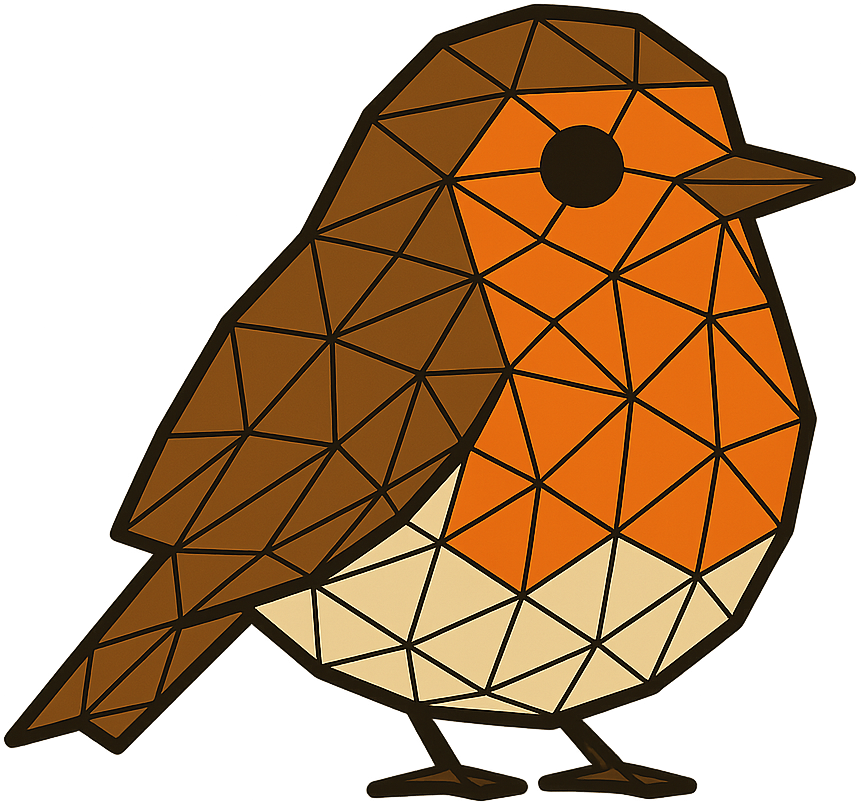

#  ROBIN: Rolling Diffusion-Batched Inference Network

This repository contains the official code release of our **NeurIPS 2025** paper:

> **[Diffusion-Based Hierarchical Graph Neural Networks for Simulating Nonlinear Solid Mechanics](https://arxiv.org/abs/2506.06045)**  
> Tobias Würth, Niklas Freymuth, Gerhard Neumann, Luise Kärger \
> Karlsruhe Institute of Technology (KIT)

---

### Overview

**ROBIN** (Rolling diffusion-Batched Inference Network) is a novel framework for simulating nonlinear solid mechanics using diffusion-based hierarchical graph neural networks. It combines three key components:

- **DDPMs** (Denoising Diffusion Probabilistic Models) — Denoising diffusion with v-prediction. Early steps predict low-frequency structure and later steps refine high-frequency details for stable long rollouts.

- **AMPNs** (Algebraic-hierarchical Message Passing Networks) — Algebraic-hierarchical Message Passing built on root-node AMG coarsening, which preserves mesh geometry and yields wide, multiscale receptive fields crucial for geometric nonlinearity.

- **ROBI** (Rolling diffusion-Batched Inference) — A novel inference scheme that parallelizes the denoising of consecutive time steps by reconstructing physical states based on partially denoised predictions, enabling efficient rollouts over long time horizons.

In short: Iterative prediction refinement (DDPMs) + multiscale message passing (AMPNs) + parallel denoising inference (ROBI)

---

### Code Release

The code will be released soon.  
Stay tuned for updates once the camera-ready version is finalized.

---

### Contact
  
**Tobias Würth** – [tobias.wuerth@kit.edu](mailto:tobias.wuerth@kit.edu)
